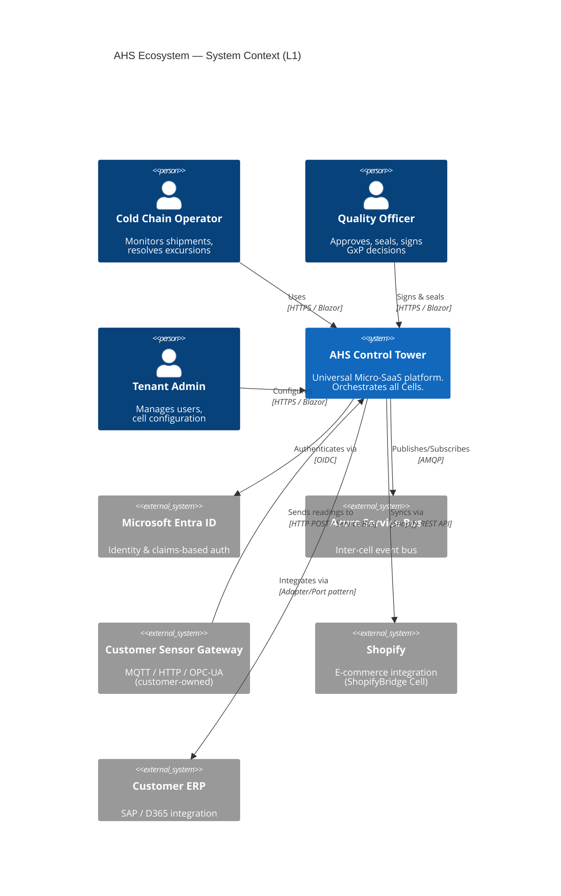
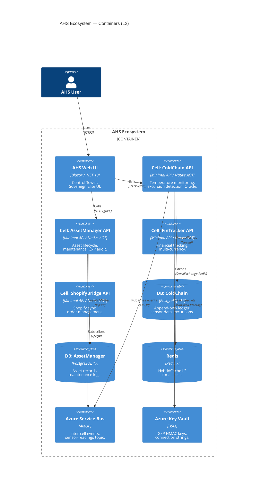
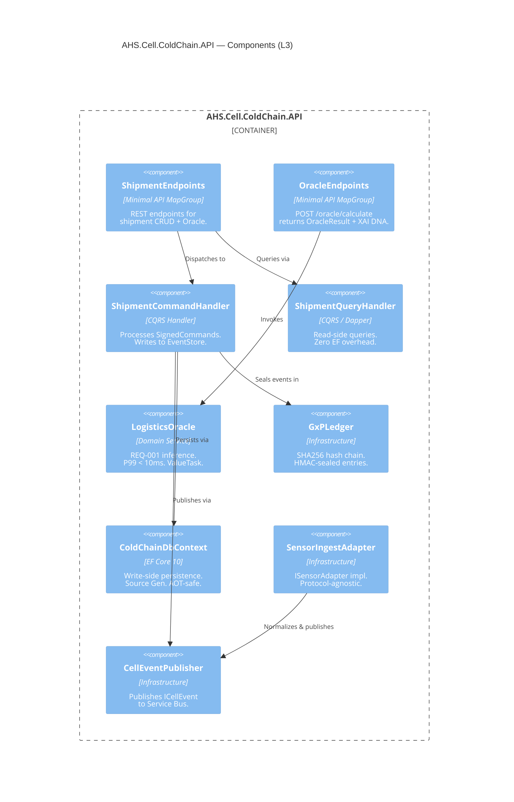

# C4 Documentation Standard — AHS Ecosystem

## C4 Ownership in AHS

| Level | Name | Owner | Output |
|---|---|---|---|
| **L1** | System Context | C1 Architect | Who uses AHS? What external systems? |
| **L2** | Container | C1 Architect | What deployable units exist? How do they communicate? |
| **L3** | Component | C2 Engineer | What's inside each container? |
| **L4** | Code | AG (generated) | Actual classes, records, interfaces |

---

## 1. Level 1 — System Context (C1 Architect)



---

## 2. Level 2 — Containers (C1 Architect)



---

## 3. Level 3 — Components (C2 Engineer)



---

## 4. Level 4 — Code (AG generates)

```
L4 is the actual generated code. C2 produces the Prompt Maestro for AG.
AG generates following the Cell Template (see: ahs-cell-template skill).

Document L4 as code comments in the generated files:
```

```csharp
/// <summary>
/// C4 L4 — ShipmentCommandHandler
/// Layer: Application
/// Cell: AHS.Cell.ColdChain
/// Responsibility: Process all state-changing commands for Shipment aggregate.
/// Dependencies: IEventStore, IGxPLedger, ICellEventPublisher
/// Pattern: CQRS Command Handler + GxP Electronic Signature
/// </summary>
public class ShipmentCommandHandler(
    IEventStore store,
    IGxPLedger ledger,
    ICellEventPublisher publisher)
{ }
```

---

## 5. Architecture Decision Records (ADR)

```markdown
# ADR-001: Database-per-Cell over Shared Schema

**Status**: Accepted
**Date**: 2025-Q1
**Deciders**: C1 Architect

## Context
AHS cells must be independently deployable and sellable as standalone Micro-SaaS.

## Decision
Each Cell owns its own PostgreSQL database (Database-per-Cell pattern).
Cross-cell data exchange via Service Bus events only. No direct DB joins.

## Consequences
+ Full cell autonomy — deploy, scale, sell independently
+ GxP compliance per cell (each DB has its own RLS + DENY policies)
+ Simpler authorization (tenant RLS per DB, not per table)
- No cross-cell JOINs (mitigated by read model projections)
- Higher infrastructure cost (multiple DBs) — offset by serverless tier

## Alternatives Rejected
- Schema-per-tenant in shared DB: violates cellular isolation
- Shared DB with discriminator: impossible to sell cells independently
```

```markdown
# ADR-002: Native AOT as Default Compilation Target

**Status**: Accepted
**Date**: 2025-Q1
**Deciders**: C1 Architect

## Context
AHS cells are deployed as Azure Container Apps with scale-to-zero.
Cold start latency directly impacts user experience and cost.

## Decision
All Cell APIs publish as Native AOT (PublishAot=true, linux-x64).
Target: cold start < 50ms, image size < 80MB.

## Consequences
+ Sub-50ms cold starts on scale-to-zero
+ ~35MB images (vs 200MB+ with full runtime)
- No reflection: requires JsonSerializerContext, Mapperly, manual DI
- No Assembly.Load(), dynamic, Expression compilation
- EF Core: no lazy loading, explicit query filters per entity

## Implementation
All cells: PublishAot=true in csproj.
CI gate: IL trim warnings treated as errors (IL2026, IL3050).
```

---

## 6. Mermaid C4 Quick Reference

```mermaid
%%{init: {'theme': 'dark'}}%%
C4Context
  %% Personas
  Person(id, "Label", "Description")
  Person_Ext(id, "External User", "Description")

  %% Systems
  System(id, "System Name", "Description")
  System_Ext(id, "External System", "Description")
  SystemDb(id, "Database", "Description")
  SystemQueue(id, "Queue", "Description")

  %% Relationships
  Rel(from, to, "Label", "Technology")
  Rel_Back(from, to, "Label")
  Rel_Neighbor(from, to, "Label")
  BiRel(a, b, "Label")

  %% Boundaries
  Boundary(id, "Label", "type") { ... }
  Enterprise_Boundary(id, "Label") { ... }
  System_Boundary(id, "Label") { ... }
  Container_Boundary(id, "Label") { ... }
```

---

## 7. PlantUML C4 (alternative for VS2026)

```plantuml
@startuml AHS-L2
!include https://raw.githubusercontent.com/plantuml-stdlib/C4-PlantUML/master/C4_Container.puml

LAYOUT_WITH_LEGEND()

title AHS Ecosystem — Container Diagram (L2)

Person(user, "AHS Operator")
System_Ext(entra, "Entra ID")

System_Boundary(ahs, "AHS Ecosystem") {
  Container(ui, "AHS.Web.UI", "Blazor/.NET 10", "Control Tower")
  Container(api, "Cell API", "Minimal API/AOT", "Domain cell")
  ContainerDb(db, "Cell DB", "PostgreSQL 17", "Isolated per cell")
  Container(bus, "Service Bus", "AMQP", "Inter-cell events")
}

Rel(user, ui, "Uses", "HTTPS")
Rel(ui, api, "Calls", "HTTP")
Rel(api, db, "Reads/Writes", "Npgsql")
Rel(api, bus, "Publishes", "AMQP")
Rel(ui, entra, "Auth via", "OIDC")

@enduml
```
