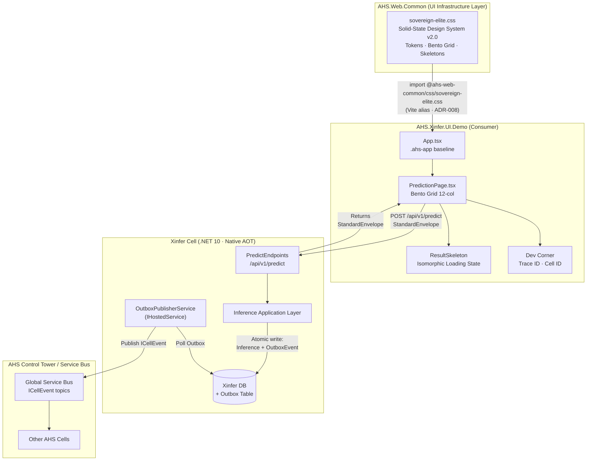

# System Architecture Document (SAD)
**Version:** 2.0 — Solid-State UI Era  
**Status:** Active · Long-Term Support (LTS)  
**Last Updated:** 2026-Q2  
**Scope:** AHS Ecosystem — Xinfer Cell + UI Layer

---

## 1. Overview

The AHS Ecosystem follows the **Cellular Architecture Blueprint V3.1.2**. Each Bounded Context is an autonomous Cell — a self-contained Micro-SaaS unit that can be deployed standalone or integrated into the AHS Control Tower. The topology guarantees strict bounded contexts, decoupled synchronous and asynchronous communication, and GxP compliance at every layer.

This document reflects the **post-Solid-State UI v2.0** architecture, in which the visual layer has been formally aligned with the same principles of isolation, determinism, and resource efficiency that govern the backend Cells.

---

## 2. Architectural Topology



---

## 3. UI Architecture — Solid-State Isomorphic System

### 3.1 Paradigm: Solid-State UI v2.0

As of this version, the AHS UI layer operates under the **Solid-State UI** paradigm, replacing all Glassmorphism effects. This is not an aesthetic preference but an architectural constraint, formally declared in the PRD Section 5 (Design Principles).

**Core constraint:**
> Se prioriza la claridad estructural y el alto contraste sobre los efectos de transparencia para garantizar la accesibilidad y el rendimiento óptimo del sistema.

### 3.2 AHS.Web.Common — Visual Infrastructure Provider

`AHS.Web.Common/wwwroot/css/sovereign-elite.css` is the **canonical source** of all visual tokens, layout primitives, and component classes across the AHS Ecosystem. No Cell UI may declare its own color tokens, blur effects, or glass surfaces.

| Responsibility | Implementation |
|---|---|
| Chromatic elevation scale | `--luma-0` → `--luma-5` (5-tier Luma hierarchy) |
| Risk semantic palette | `--risk-safe`, `--risk-caution`, `--risk-critical` |
| Layout system | `.bento-grid`, `.bento-col-*`, `.bento-row-*` |
| Surface components | `.solid-panel`, `.solid-panel--nested`, `.solid-panel--brand` |
| Loading states | `.skeleton`, `.skeleton--*` preset blocks |
| Transitions | `--t-instant: 80ms`, `--t-quick: 150ms` — deterministic only |

### 3.3 Bento Grid — Backend-to-UI Isomorphism

The Bento Grid is not purely aesthetic. Each Bento cell has a **1:1 semantic relationship** with a backend service or data domain:

| Bento Cell | Cols | Backend Mapping |
|---|---|---|
| Input Panel (Cell A) | 5 | `InferenceInput_v1` contract fields |
| Result / XAI Panel (Cell B) | 7 | `InferenceOutput_v1` + XAI `influence_factors[]` |
| Dev Corner overlay | fixed | `StandardEnvelope.metadata` + `status.trace_id` |

This isomorphism guarantees that skeleton loading states can occupy the **exact same grid dimensions** as the live content, ensuring structural visual stability before and after data arrival — eliminating layout shift (CLS = 0).

### 3.4 Performance Constraint — Low Resource Footprint

The UI must operate under a **zero-cost rendering budget** for compositing effects. The following are **explicitly prohibited** in all AHS Cell UIs, associated with the same zero-overhead principles that mandate Native AOT in the backend (ADR-002):

| Prohibited | Reason |
|---|---|
| `backdrop-filter: blur()` | GPU compositing layer — costly on low-power devices |
| `rgba()` with alpha < 0.9 on solid surfaces | Forces stacking context recalculations |
| `box-shadow` with large spread/blur | Triggers repaint on animation |
| CSS `filter:` on large elements | Full-layer rasterization |
| Easing curves longer than 150ms | Perceived latency in data-dense UIs |

All depth and hierarchy are expressed exclusively through **chromatic elevation** (Luma scale) and **1px stroke borders** (Stroke-based design).

---

## 4. Traceability Architecture — Dev Corner

The **Dev Corner** component (rendered by `PredictionPage.tsx`, styled via `.dev-corner` in `sovereign-elite.css`) is the visual manifestation of the GxP traceability capability defined in the `StandardEnvelope` contract.

```
StandardEnvelope<T>
├── metadata
│   ├── cell_id      ──► Dev Corner: "Cell ID" row
│   └── contract_version
├── data: T
└── status
    ├── code
    ├── message
    └── trace_id     ──► Dev Corner: "Trace ID" row
```

Every inference request generates a unique `trace_id` that flows from the Xinfer Cell through the `StandardEnvelope.status` object to the UI. This trace ID is:
- Visible to the operator in the Dev Corner overlay during demos and testing.
- Persisted in the Outbox event and propagated to the AHS Control Tower via the Service Bus.
- Queryable in the GxP immutable audit ledger for FDA 21 CFR Part 11 compliance.

---

## 5. Outbox Pattern — Asynchronous Consistency Guarantee

The Xinfer Cell's independence is protected by the **Outbox Pattern**, which decouples the cell from the global messaging fabric:

1. The inference command handler writes both the inference result **and** an `InferenceGeneratedEvent` to the Xinfer DB in a **single atomic transaction**.
2. The `OutboxPublisherService` (`IHostedService` / Singleton) polls the Outbox table independently.
3. It publishes pending events to the global Service Bus via a locally-scoped `IDbConnectionFactory` (scoped isolation per ADR-009 — no singleton-to-scoped lifetime violations).
4. If the Service Bus is unavailable, the Outbox retains events until the next poll cycle. **The Cell never loses an event and never blocks a request.**

---

## 6. Contract Versioning and Commercial Isolation

Per **ADR-010**, the Xinfer Cell is architecturally ready for commercial extraction as an independent Micro-SaaS:

- All inbound/outbound communication uses versioned contracts (`InferenceInput_v1`, `InferenceOutput_v1`).
- The `StandardEnvelope` is the universal adapter — no consumer ever touches Xinfer's domain internals.
- Breaking changes require a new `_v2` record type with dual-publish for a minimum of 2 sprints.
- The Cell's isolated database means zero shared schema coupling with other Cells.

---

## 7. LTS Readiness and Multitenant Growth

This architecture is declared **Long-Term Support (LTS) ready** based on the following criteria:

### 7.1 Stability Guarantees
| Concern | Strategy |
|---|---|
| UI drift | ADR-008 enforcement — `AHS.Web.Common` is the single CSS authority |
| API breaking changes | Contract versioning with dual-publish window (ADR-007) |
| Backend divergence | ADR-009 CI alignment checks (AOT trim warnings, SignedCommand grep) |
| Documentation drift | `/docs` is the declared Source of Truth (see `docs/README.md`) |

### 7.2 Multitenant Architecture
The Xinfer Cell is multitenant by design via `TenantSessionInterceptor` (from `AHS.Common`), registered in the DI container at startup. All database queries are automatically scoped to the active tenant:

- The `TenantMiddleware` resolves the `ITenantContext` from the incoming HTTP request headers.
- The `IDbConnectionFactory` (scoped) receives the tenant context through DI before any query executes.
- The Xinfer UI Demo passes tenant context via the `StandardEnvelope.metadata` fields.
- New tenants require zero infrastructure changes — the Cell scales horizontally per tenant workload.

### 7.3 Observability
| Signal | Implementation |
|---|---|
| Structured logging | `AnalysisId` + `TenantId` correlation on every log entry |
| Trace propagation | `trace_id` from `StandardEnvelope` → Outbox → Service Bus |
| Health endpoints | `GET /health` (liveness) · `GET /health/operational` (readiness) |
| Audit trail | GxP immutable ledger — append-only, SHA-256 sealed entries |

---

## 8. Inference Bridge — Engine Abstraction & Commercial Sovereignty

The **Inference Bridge** is the architectural pattern that decouples the Xinfer Cell's business logic from any concrete AI/ML runtime. It is the technical expression of the Cell's **Commercial Sovereignty** guarantee (ADR-010): the Cell can be extracted and sold as an independent inference Micro-SaaS with a different underlying model, without touching a single line of application or domain code.

### 8.1 Port Hierarchy

```
Application Layer (Ports/)
│
├── IInferenceService        ← High-level orchestration port
│   └── Validates input (input_v1 business rules)
│   └── Delegates to IInferenceEngine
│
└── IInferenceEngine         ← Engine abstraction port (Inference Bridge)
    ├── MockInferenceEngine  ← Ruta A: deterministic heuristics (current)
    └── OnnxInferenceEngine  ← Ruta B: Microsoft.ML.OnnxRuntime (stub, ready)
```

The Cell's command handlers and API endpoints **only depend on `IInferenceService`**. Neither the engine implementation nor its runtime dependency (`OnnxRuntime`) ever leaks into the Application or Domain layers.

### 8.2 Engine Swap Protocol

To activate Ruta B (real ONNX model), a single DI registration change is required in `XinferServiceExtensions.cs`:

```csharp
// Ruta A (current)
services.AddSingleton<IInferenceEngine, MockInferenceEngine>();

// Ruta B (ONNX activation — no application code changes)
services.AddSingleton<IInferenceEngine, OnnxInferenceEngine>();
```

Add `Xinfer:OnnxModelPath` to `appsettings.json` and implement `OnnxInferenceEngine.RunAsync()`. The `MockInferenceService` orchestrator, all handlers, and all API endpoints remain identical.

### 8.3 `confidence_score` — Semantic & GxP Obligation

The `confidence_score` (Float, 0.0–1.0) is a **first-class contract field** in `inference_v1`, not an optional metric. It represents the model's self-assessed certainty about its prediction.

| Value Range | Interpretation | System Response |
|---|---|---|
| ≥ 0.60 | Nominal confidence | UI: `--risk-safe` (green) · Ledger: standard entry |
| < 0.60 | Low confidence | UI: `--risk-caution` (amber) · Ledger: flagged for human review |

**GxP Audit requirement (21 CFR Part 11 / ALCOA+ Completeness):** The `confidence_score` is persisted in the `PredictOkEvent` domain event that flows to the GxP immutable ledger via the Outbox. A prediction record without its certainty metric is **incomplete** and not auditable under the AHS standard. This is enforced at the `PredictOkEvent` contract level (see `/src/Cells/Xinfer/AHS.Cell.Xinfer.Contracts/PredictOkEvent.cs`).

### 8.4 Commercial Sovereignty Guarantee

> **The Inference Bridge is the architectural mechanism that makes Xinfer engine-agnostic.**
>
> A customer purchasing the Xinfer Cell as a standalone Micro-SaaS is buying the **risk inference business logic, the GxP audit guarantees, and the `inference_v1` contract** — not a specific ML runtime. This means:
>
> - AHS can integrate `MockInferenceEngine` (no model required) for rapid customer onboarding.
> - AHS can upgrade to a proprietary or customer-supplied `.onnx` model for premium tiers.
> - A third-party engine (e.g., Azure ML, a custom Python service via gRPC) can be wired in by implementing `IInferenceEngine` — the commercial product is unchanged.
>
> This separation is **non-negotiable** and is enforced by the Clean Architecture layer tests in `AHS.Cell.Xinfer.Tests` (NetArchTest: Application layer must not reference Infrastructure).

---

*This document is maintained in `/docs/architecture/sad.md` and is considered the authoritative architectural reference for all engineers and auditors working on the AHS Xinfer Cell.*

